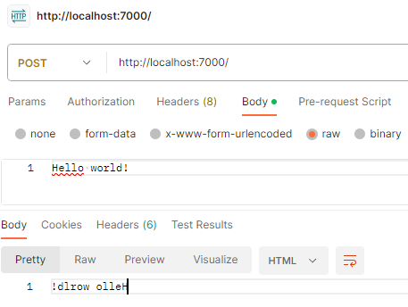

# mruv
**mruv = mruby + libuv**

> mruv is a proof-of-concept for a scriptable web server using mruby. It's designed as single binary toolkit for creating (hopefully fast and secure) dynamic web applications.

## System Requirements
- git
- Docker
- GNU/Linux x86

## Getting Started
### Development
#### Local machine docker
- Clone repository
- Load the dev container in vscode or docker

#### Github codespaces
- Simply open up in github codespace, the full development environment runs nicely in the browser

## Development Notes
### TODO
- [x] statically linked mruby + libuv (single binary)
- [x] proof of concept ruby dsl scripting for callbacks to events, similar to ruby rack config.ru
- [x] libuv TCP socket handling
- [x] http request parsing & response generation
- [x] proof of concept testing in postman
- [ ] mruv context handling
- [ ] JSON handling library
- [ ] MIME handling
- [ ] unit testing
- [ ] improve c handling + research valgrind / ASAN and other dynamic memory testing tools
- [ ] chunked content + streaming (generally, handle as much of http/1.1 spec as possible)

### Examples


`config.rb`
```rb
def handler(body)
  body.reverse
end
```
